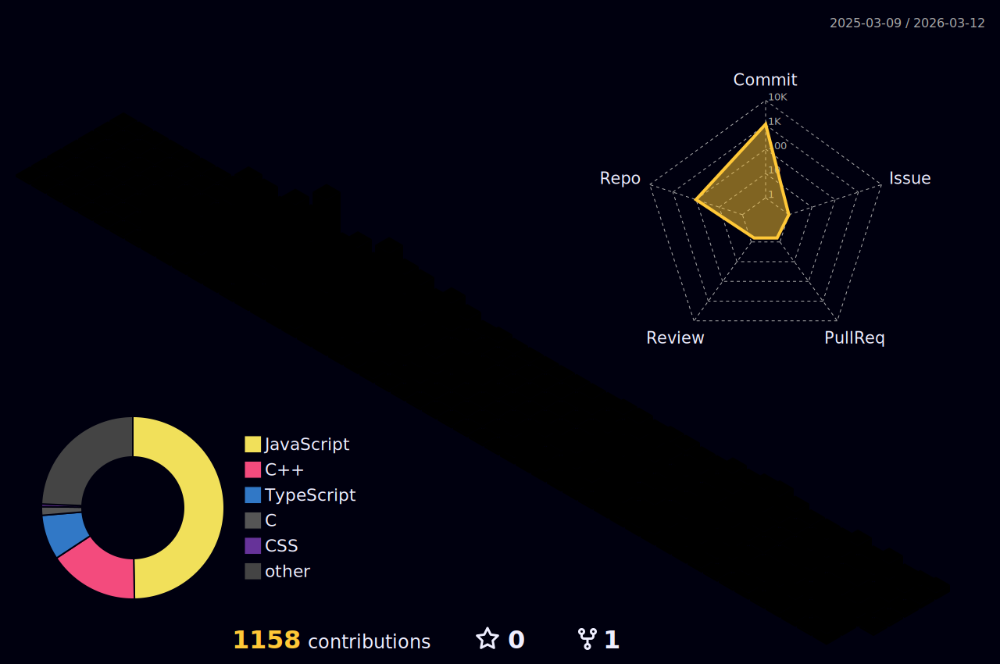

---

<h1 align="center">Hi 👋, I'm RafiZaman</h1>
<h3 align="center">A Frontend Web Developer</h3>

### Glad to see you here! :octocat:

I'm a **Front End Web Developer**. I am a tech enthusiast.I studied B.sc Engineering in RUET.But unfortunately I couldn't get going due to my illness.After this i had to leave my university and then i devoted myself to learn coding.Programming is a vast knowledge of skills and logics.For that u need to work hard with immense passion. I have huge interests in software engineering. Now i am working on web development sector and continuously learning different aspects of this field as well.

---

<p align="left"> <a href="https://github.com/ryo-ma/github-profile-trophy"></a> </p>


- 🔭 I’m currently working on **Some frontend projects**

- 🌱 Currently learning **Mern Stack**

- 🛠️ Love solving **real-world problems with code**
  
- 🎨 Enjoy creating **visually appealing and functional interfaces**

- 👯 Looking to **contribute more in github in future**

- 📫 How to reach me **rafiirfan211@gmail.com**

- ⚡ Fun fact **Love to play cricket and play games**

---

### 🛠 Languages and Tools:

<div align="center">
  <a href="https://skillicons.dev">
    
  </a>
</div>

---

### 🧠 Daily Dev Routine + Philosophy

<p align="center">
  
</p>

### :boy: A little more about me:

```javascript
const rafi = {
  name: "Rafi Irfan Zaman",
  pronouns: "He" | "Him",
  languageSpoken: ["en_US", "bn_BD"],
  code: ["Javascript", "HTML", "CSS"],
  askMeAbout: ["web dev", "tech"],
  technologies: {
    web: {
      frontEnd: ["ReactJS", "NextJS", "Redux", "Bootstrap 5", "Tailwind CSS"],
      backEnd: ["NodeJS", "ExpressJS", "mongoose"],
    },
    databases: ["mongoDB"],
    misc: ["Firebase"],
  },
  currentFocus: "Front-End Web Development",
  nextTarget: "Competitive programming",
};
```

<!--START_SECTION:waka-->


**🐱 My GitHub Data** 

> 📦 1.3 MB Used in GitHub's Storage 
 > 
> 🏆 720 Contributions in the Year 2025
 > 
> 🚫 Not Opted to Hire
 > 
> 📜 215 Public Repositories 
 > 
> 🔑 8 Private Repositories 
 > 
**I'm a Night 🦉** 

```text
🌞 Morning                43 commits          █░░░░░░░░░░░░░░░░░░░░░░░░   02.77 % 
🌆 Daytime                559 commits         █████████░░░░░░░░░░░░░░░░   36.04 % 
🌃 Evening                710 commits         ███████████░░░░░░░░░░░░░░   45.78 % 
🌙 Night                  239 commits         ████░░░░░░░░░░░░░░░░░░░░░   15.41 % 
```
📅 **I'm Most Productive on Tuesday** 

```text
Monday                   146 commits         ██░░░░░░░░░░░░░░░░░░░░░░░   09.41 % 
Tuesday                  343 commits         ██████░░░░░░░░░░░░░░░░░░░   22.11 % 
Wednesday                325 commits         █████░░░░░░░░░░░░░░░░░░░░   20.95 % 
Thursday                 174 commits         ███░░░░░░░░░░░░░░░░░░░░░░   11.22 % 
Friday                   200 commits         ███░░░░░░░░░░░░░░░░░░░░░░   12.89 % 
Saturday                 177 commits         ███░░░░░░░░░░░░░░░░░░░░░░   11.41 % 
Sunday                   186 commits         ███░░░░░░░░░░░░░░░░░░░░░░   11.99 % 
```


📊 **This Week I Spent My Time On** 

```text
🕑︎ Time Zone: Asia/Dhaka

💬 Programming Languages: 
TypeScript               6 hrs 28 mins       ██████████░░░░░░░░░░░░░░░   38.37 % 
JavaScript               6 hrs               █████████░░░░░░░░░░░░░░░░   35.56 % 
JSON                     1 hr 59 mins        ███░░░░░░░░░░░░░░░░░░░░░░   11.74 % 
Bash                     54 mins             █░░░░░░░░░░░░░░░░░░░░░░░░   05.38 % 
Markdown                 32 mins             █░░░░░░░░░░░░░░░░░░░░░░░░   03.21 % 

🔥 Editors: 
CLion                    6 hrs 36 mins       ██████████░░░░░░░░░░░░░░░   39.08 % 
IntelliJ IDEA            5 hrs 19 mins       ████████░░░░░░░░░░░░░░░░░   31.51 % 
WebStorm                 2 hrs 37 mins       ████░░░░░░░░░░░░░░░░░░░░░   15.56 % 
PyCharm                  1 hr 49 mins        ███░░░░░░░░░░░░░░░░░░░░░░   10.79 % 
PhpStorm                 31 mins             █░░░░░░░░░░░░░░░░░░░░░░░░   03.07 % 

🐱‍💻 Projects: 
cognitionx               6 hrs 1 min         █████████░░░░░░░░░░░░░░░░   35.70 % 
vaultly                  2 hrs 6 mins        ███░░░░░░░░░░░░░░░░░░░░░░   12.51 % 
peddy                    1 hr 57 mins        ███░░░░░░░░░░░░░░░░░░░░░░   11.56 % 
jerins-parlour           1 hr 43 mins        ███░░░░░░░░░░░░░░░░░░░░░░   10.16 % 
donate-bangladesh        1 hr 16 mins        ██░░░░░░░░░░░░░░░░░░░░░░░   07.54 % 

💻 Operating System: 
Windows                  16 hrs 53 mins      █████████████████████████   100.00 % 
```

**I Mostly Code in JavaScript** 

```text
JavaScript               109 repos           ████████████░░░░░░░░░░░░░   47.19 % 
HTML                     54 repos            ██████░░░░░░░░░░░░░░░░░░░   23.38 % 
CSS                      38 repos            ████░░░░░░░░░░░░░░░░░░░░░   16.45 % 
TypeScript               24 repos            ███░░░░░░░░░░░░░░░░░░░░░░   10.39 % 
Vue                      1 repo              ░░░░░░░░░░░░░░░░░░░░░░░░░   00.43 % 
```


 Last Updated on 22/07/2025 01:17:40 UTC
<!--END_SECTION:waka-->

<div align="center">
  
  <br />

  
  <br />
  

<br />

  
</div>

<p align="center">
  <a href="https://github.com/rafi983">
    
  </a>
</p>




[](https://github.com/rafi983/FancySlider)
[](https://github.com/rafi983/Tic-Tac-Toe)

[](https://github.com/rafi983/Hungry-Monster)
[](https://github.com/rafi983/WeatherApp-Js)

[](https://github.com/rafi983/Natours)
[](https://github.com/rafi983/Glassmorphism-Calculator)

[](https://github.com/rafi983/Backroads-site)
[](https://github.com/rafi983/Tea-station)

[](https://github.com/rafi983/searchGithubUsers)
[](https://github.com/rafi983/carbonizo-client-side)
