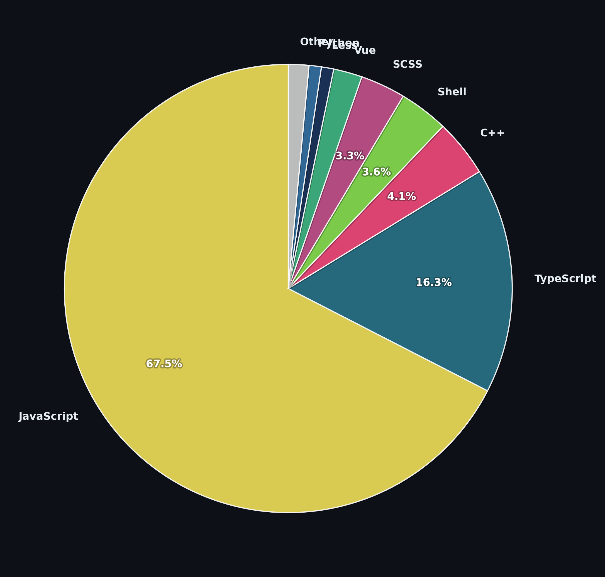

---

<h1 align="center">Hi 👋, I'm RafiZaman</h1>
<h3 align="center">A Full Stack Web Developer</h3>

### Glad to see you here! :octocat:

I'm a **Full Stack Web Developer**. I am a tech enthusiast. I studied B.sc Engineering in RUET. But unfortunately I couldn't get going due to my illness. After this i had to leave my university and then i devoted myself to learn coding. Programming is a vast knowledge of skills and logics. For that u need to work hard with immense passion. I have huge interests in software engineering. Now i am working on web development sector and continuously learning different aspects of this field as well.

---


- 🔭 I’m currently working on **Some frontend projects**

- 🌱 Currently learning **Angular Js**

- 🛠️ Love solving **real-world problems with code**
  
- 🎨 Enjoy creating **visually appealing and functional interfaces**

- 👯 Looking to **contribute more in github in future**

- 📫 How to reach me **rafiirfan211@gmail.com**

- ⚡ Fun fact **Love to play cricket and play games**

---

###  Connections:

<p align="left">
<a href="https://www.linkedin.com/in/rafi-irfan-zaman/" target="blank"></a>  
<a href="https://www.codechef.com/users/riz82" target="blank"></a>
<a href="https://www.hackerrank.com/profile/riz82" target="blank"></a>
<a href="https://codeforces.com/profile/riz82" target="blank"></a>
<a href="https://www.leetcode.com/riz82" target="blank"></a>
</p>

---

### 🛠 Languages and Tools:

<div align="center">
  <a href="https://skillicons.dev">
    
  </a>
</div>

---

### 🧠 Daily Dev Routine + Philosophy

<p align="center">
  
</p>

### :boy: A little more about me:

```javascript
const rafi = {
  name: "Rafi Irfan Zaman",
  pronouns: "He" | "Him",
  languageSpoken: ["en_US", "bn_BD"],
  code: ["Javascript", "HTML", "CSS"],
  askMeAbout: ["web dev", "tech"],
  technologies: {
    web: {
      frontEnd: ["ReactJS","NextJS","VueJS","Redux","Bootstrap", "Material UI", "ShadCN UI","Tailwind CSS"],
      backEnd: ["NodeJS", "ExpressJS", "mongoose"],
    },
    databases: ["mongoDB", "mySQL","prisma","PostgreSQL"],
    misc: ["Firebase"],
  },
  currentFocus: "Full Stack Web Development",
  nextTarget: "Machine Learning",
};
```

<!--START_SECTION:waka-->


**🐱 My GitHub Data** 

> 📦 1.5 MB Used in GitHub's Storage 
 > 
> 🏆 382 Contributions in the Year 2026
 > 
> 🚫 Not Opted to Hire
 > 
> 📜 294 Public Repositories 
 > 
> 🔑 0 Private Repositories 
 > 
**I'm a Night 🦉** 

```text
🌞 Morning                49 commits          █░░░░░░░░░░░░░░░░░░░░░░░░   02.20 % 
🌆 Daytime                979 commits         ███████████░░░░░░░░░░░░░░   43.98 % 
🌃 Evening                928 commits         ██████████░░░░░░░░░░░░░░░   41.69 % 
🌙 Night                  270 commits         ███░░░░░░░░░░░░░░░░░░░░░░   12.13 % 
```
📅 **I'm Most Productive on Tuesday** 

```text
Monday                   237 commits         ███░░░░░░░░░░░░░░░░░░░░░░   10.65 % 
Tuesday                  428 commits         █████░░░░░░░░░░░░░░░░░░░░   19.23 % 
Wednesday                419 commits         █████░░░░░░░░░░░░░░░░░░░░   18.82 % 
Thursday                 274 commits         ███░░░░░░░░░░░░░░░░░░░░░░   12.31 % 
Friday                   272 commits         ███░░░░░░░░░░░░░░░░░░░░░░   12.22 % 
Saturday                 289 commits         ███░░░░░░░░░░░░░░░░░░░░░░   12.98 % 
Sunday                   307 commits         ███░░░░░░░░░░░░░░░░░░░░░░   13.79 % 
```


📊 **This Week I Spent My Time On** 

```text
🕑︎ Time Zone: Asia/Dhaka

💬 Programming Languages: 
Vue                      2 hrs 16 mins       ███████░░░░░░░░░░░░░░░░░░   28.12 % 
Markdown                 2 hrs 4 mins        ██████░░░░░░░░░░░░░░░░░░░   25.55 % 
JavaScript               1 hr 57 mins        ██████░░░░░░░░░░░░░░░░░░░   24.16 % 
C++                      37 mins             ██░░░░░░░░░░░░░░░░░░░░░░░   07.72 % 
Other                    21 mins             █░░░░░░░░░░░░░░░░░░░░░░░░   04.52 % 

🔥 Editors: 
Windsurf                 7 hrs 34 mins       ███████████████████████░░   93.50 % 
IntelliJ IDEA            31 mins             ██░░░░░░░░░░░░░░░░░░░░░░░   06.50 % 

🐱‍💻 Projects: 
Aventoura                1 hr 48 mins        ██████░░░░░░░░░░░░░░░░░░░   22.23 % 
codeforces_probs_2       37 mins             ██░░░░░░░░░░░░░░░░░░░░░░░   07.72 % 
ip-tracker               37 mins             ██░░░░░░░░░░░░░░░░░░░░░░░   07.65 % 
rest-countries-api       33 mins             ██░░░░░░░░░░░░░░░░░░░░░░░   06.86 % 
interactive-card-details-29 mins             ██░░░░░░░░░░░░░░░░░░░░░░░   06.07 % 

💻 Operating System: 
Windows                  8 hrs 6 mins        █████████████████████████   100.00 % 
```

**I Mostly Code in JavaScript** 

```text
JavaScript               124 repos           ██████████░░░░░░░░░░░░░░░   40.92 % 
TypeScript               51 repos            ████░░░░░░░░░░░░░░░░░░░░░   16.83 % 
Vue                      29 repos            ██░░░░░░░░░░░░░░░░░░░░░░░   09.57 % 
C++                      14 repos            █░░░░░░░░░░░░░░░░░░░░░░░░   04.62 % 
Python                   3 repos             ░░░░░░░░░░░░░░░░░░░░░░░░░   00.99 % 
```


 Last Updated on 21/05/2026 00:41:47 UTC
<!--END_SECTION:waka-->


<div align="center">
  
  <!-- 🥧 Pie chart (fixed size) -->
  

  
  <br />
  
  <a href="https://git.io/streak-stats">
    
  </a>

  <br />

  
</div>

<p align="center">
  <a href="https://github.com/rafi983">
    
  </a>
</p>


