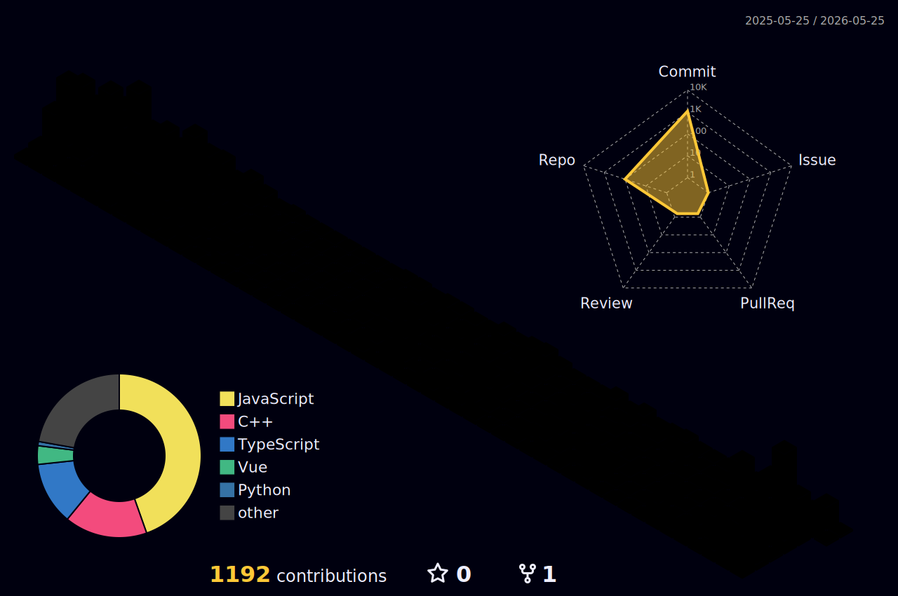

---

<h1 align="center">Hi 👋, I'm RafiZaman</h1>
<h3 align="center">A Frontend Web Developer</h3>

### Glad to see you here! :octocat:

I'm a **Front End Web Developer**. I am a tech enthusiast.I studied B.sc Engineering in RUET.But unfortunately I couldn't get going due to my illness.After this i had to leave my university and then i devoted myself to learn coding.Programming is a vast knowledge of skills and logics.For that u need to work hard with immense passion. I have huge interests in software engineering. Now i am working on web development sector and continuously learning different aspects of this field as well.

---


- 🔭 I’m currently working on **Some frontend projects**

- 🌱 Currently learning **Mern Stack**

- 🛠️ Love solving **real-world problems with code**
  
- 🎨 Enjoy creating **visually appealing and functional interfaces**

- 👯 Looking to **contribute more in github in future**

- 📫 How to reach me **rafiirfan211@gmail.com**

- ⚡ Fun fact **Love to play cricket and play games**

---

###  Connections:

<p align="left">
<a href="https://www.linkedin.com/in/rafi-irfan-zaman/" target="blank"></a>  
<a href="https://www.codechef.com/users/riz82" target="blank"></a>
<a href="https://www.hackerrank.com/profile/riz82" target="blank"></a>
<a href="https://codeforces.com/profile/riz82" target="blank"></a>
<a href="https://www.leetcode.com/riz82" target="blank"></a>
</p>

---

### 🛠 Languages and Tools:

<div align="center">
  <a href="https://skillicons.dev">
    
  </a>
</div>

---

### 🧠 Daily Dev Routine + Philosophy

<p align="center">
  
</p>

### :boy: A little more about me:

```javascript
const rafi = {
  name: "Rafi Irfan Zaman",
  pronouns: "He" | "Him",
  languageSpoken: ["en_US", "bn_BD"],
  code: ["Javascript", "HTML", "CSS"],
  askMeAbout: ["web dev", "tech"],
  technologies: {
    web: {
      frontEnd: ["ReactJS", "NextJS", "Redux", "Bootstrap 5", "Tailwind CSS"],
      backEnd: ["NodeJS", "ExpressJS", "mongoose"],
    },
    databases: ["mongoDB"],
    misc: ["Firebase"],
  },
  currentFocus: "Front-End Web Development",
  nextTarget: "Competitive programming",
};
```

<!--START_SECTION:waka-->


**🐱 My GitHub Data** 

> 📦 1.3 MB Used in GitHub's Storage 
 > 
> 🏆 153 Contributions in the Year 2026
 > 
> 🚫 Not Opted to Hire
 > 
> 📜 259 Public Repositories 
 > 
> 🔑 0 Private Repositories 
 > 
**I'm a Night 🦉** 

```text
🌞 Morning                48 commits          █░░░░░░░░░░░░░░░░░░░░░░░░   02.46 % 
🌆 Daytime                788 commits         ██████████░░░░░░░░░░░░░░░   40.43 % 
🌃 Evening                855 commits         ███████████░░░░░░░░░░░░░░   43.87 % 
🌙 Night                  258 commits         ███░░░░░░░░░░░░░░░░░░░░░░   13.24 % 
```
📅 **I'm Most Productive on Tuesday** 

```text
Monday                   195 commits         ███░░░░░░░░░░░░░░░░░░░░░░   10.01 % 
Tuesday                  391 commits         █████░░░░░░░░░░░░░░░░░░░░   20.06 % 
Wednesday                384 commits         █████░░░░░░░░░░░░░░░░░░░░   19.70 % 
Thursday                 246 commits         ███░░░░░░░░░░░░░░░░░░░░░░   12.62 % 
Friday                   249 commits         ███░░░░░░░░░░░░░░░░░░░░░░   12.78 % 
Saturday                 253 commits         ███░░░░░░░░░░░░░░░░░░░░░░   12.98 % 
Sunday                   231 commits         ███░░░░░░░░░░░░░░░░░░░░░░   11.85 % 
```


📊 **This Week I Spent My Time On** 

```text
🕑︎ Time Zone: Asia/Dhaka

💬 Programming Languages: 
C++                      41 mins             ██████████░░░░░░░░░░░░░░░   38.89 % 
.env file                35 mins             ████████░░░░░░░░░░░░░░░░░   32.74 % 
Python                   28 mins             ███████░░░░░░░░░░░░░░░░░░   26.72 % 
GitIgnore file           1 min               ░░░░░░░░░░░░░░░░░░░░░░░░░   01.66 % 

🔥 Editors: 
CLion                    41 mins             ██████████░░░░░░░░░░░░░░░   38.89 % 
WebStorm                 37 mins             █████████░░░░░░░░░░░░░░░░   34.40 % 
PyCharm                  28 mins             ███████░░░░░░░░░░░░░░░░░░   26.72 % 

🐱‍💻 Projects: 
codeforces_probs_2       41 mins             ██████████░░░░░░░░░░░░░░░   38.89 % 
gadgetsbd                37 mins             █████████░░░░░░░░░░░░░░░░   34.40 % 
sdtxm_1                  28 mins             ███████░░░░░░░░░░░░░░░░░░   26.72 % 

💻 Operating System: 
Windows                  1 hr 47 mins        █████████████████████████   100.00 % 
```

**I Mostly Code in JavaScript** 

```text
JavaScript               126 repos           ████████████░░░░░░░░░░░░░   47.01 % 
CSS                      38 repos            ████░░░░░░░░░░░░░░░░░░░░░   14.18 % 
TypeScript               32 repos            ███░░░░░░░░░░░░░░░░░░░░░░   11.94 % 
C++                      13 repos            █░░░░░░░░░░░░░░░░░░░░░░░░   04.85 % 
Python                   2 repos             ░░░░░░░░░░░░░░░░░░░░░░░░░   00.75 % 
```


 Last Updated on 18/04/2026 00:27:51 UTC
<!--END_SECTION:waka-->


<div align="center">
  
  
  <br />

  
  <br />
  
  
<a href="https://git.io/streak-stats">

</a>

<br />

  
</div>

<p align="center">
  <a href="https://github.com/rafi983">
    
  </a>
</p>



