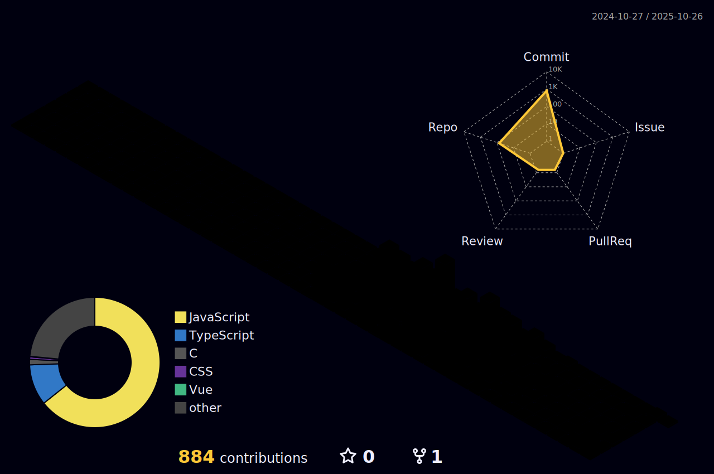

---

<h1 align="center">Hi 👋, I'm RafiZaman</h1>
<h3 align="center">A Frontend Web Developer</h3>

### Glad to see you here! :octocat:

> I'm a **Front End Web Developer**. I am a tech enthusiast.I studied B.sc Engineering in RUET.But unfortunately I couldn't get going due to my illness.After this i had to leave my university and then i devoted myself to learn coding.Programming is a vast knowledge of skills and logics.For that u need to work hard with immense passion. I have huge interests in software engineering. Now i am working on web development sector and continuously learning different aspects of this field as well.

---

<p align="left"> <a href="https://github.com/ryo-ma/github-profile-trophy"></a> </p>


- 🔭 I’m currently working on **Some frontend projects**

- 🌱 I’m currently learning **Mern Stack**

- 🛠️ Love solving **real-world problems with code**
  
- 🎨 Enjoy creating **visually appealing and functional interfaces**

- 👯 Looking to **contribute more in github in future**

- 📫 How to reach me **rafiirfan211@gmail.com**

- ⚡ Fun fact **Love to play cricket and play games**

---

### 🛠 Languages and Tools:

<div align="center">
  <a href="https://skillicons.dev">
    
  </a>
</div>

---


### 🧠 Daily Dev Routine + Philosophy

<p align="center">
  
</p>

### :boy: A little more about me:

```javascript
const rafi = {
  name: "Rafi Irfan Zaman",
  pronouns: "He" | "Him",
  languageSpoken: ["en_US", "bn_BD"],
  code: ["Javascript", "HTML", "CSS"],
  askMeAbout: ["web dev", "tech"],
  technologies: {
    web: {
      frontEnd: ["ReactJS", "NextJS", "Redux", "Bootstrap 5", "Tailwind CSS"],
      backEnd: ["NodeJS", "ExpressJS", "mongoose"],
    },
    databases: ["mongoDB"],
    misc: ["Firebase"],
  },
  currentFocus: "Front-End Web Development",
  nextTarget: "Competitive programming",
};
```

<!--START_SECTION:waka-->


**🐱 My GitHub Data** 

> 📦 925.6 kB Used in GitHub's Storage 
 > 
> 🚫 Not Opted to Hire
 > 
> 📜 180 Public Repositories 
 > 
> 🔑 4 Private Repositories 
 > 
**I'm a Night 🦉** 

```text
🌞 Morning                37 commits          █░░░░░░░░░░░░░░░░░░░░░░░░   02.87 % 
🌆 Daytime                439 commits         ████████░░░░░░░░░░░░░░░░░   34.00 % 
🌃 Evening                579 commits         ███████████░░░░░░░░░░░░░░   44.85 % 
🌙 Night                  236 commits         █████░░░░░░░░░░░░░░░░░░░░   18.28 % 
```
📅 **I'm Most Productive on Tuesday** 

```text
Monday                   105 commits         ██░░░░░░░░░░░░░░░░░░░░░░░   08.13 % 
Tuesday                  294 commits         ██████░░░░░░░░░░░░░░░░░░░   22.77 % 
Wednesday                291 commits         ██████░░░░░░░░░░░░░░░░░░░   22.54 % 
Thursday                 152 commits         ███░░░░░░░░░░░░░░░░░░░░░░   11.77 % 
Friday                   172 commits         ███░░░░░░░░░░░░░░░░░░░░░░   13.32 % 
Saturday                 153 commits         ███░░░░░░░░░░░░░░░░░░░░░░   11.85 % 
Sunday                   124 commits         ██░░░░░░░░░░░░░░░░░░░░░░░   09.60 % 
```


📊 **This Week I Spent My Time On** 

```text
🕑︎ Time Zone: Asia/Dhaka

💬 Programming Languages: 
JavaScript               20 hrs 2 mins       ████████████████████░░░░░   80.13 % 
HTML                     1 hr 19 mins        █░░░░░░░░░░░░░░░░░░░░░░░░   05.31 % 
Markdown                 1 hr 12 mins        █░░░░░░░░░░░░░░░░░░░░░░░░   04.86 % 
JSON                     44 mins             █░░░░░░░░░░░░░░░░░░░░░░░░   02.95 % 
TypeScript               30 mins             █░░░░░░░░░░░░░░░░░░░░░░░░   02.01 % 

🔥 Editors: 
WebStorm                 9 hrs 24 mins       █████████░░░░░░░░░░░░░░░░   37.62 % 
IntelliJ IDEA            7 hrs 18 mins       ███████░░░░░░░░░░░░░░░░░░   29.22 % 
PhpStorm                 5 hrs 57 mins       ██████░░░░░░░░░░░░░░░░░░░   23.80 % 
VS Code                  2 hrs 20 mins       ██░░░░░░░░░░░░░░░░░░░░░░░   09.36 % 

🐱‍💻 Projects: 
lws_ai-studio            17 hrs 24 mins      █████████████████░░░░░░░░   69.61 % 
lws_weather-dashboard    1 hr 29 mins        █░░░░░░░░░░░░░░░░░░░░░░░░   05.97 % 
mood-tracker             1 hr 25 mins        █░░░░░░░░░░░░░░░░░░░░░░░░   05.67 % 
batch-3-assignment-4-lws-1 hr 13 mins        █░░░░░░░░░░░░░░░░░░░░░░░░   04.91 % 
today_i-learned          58 mins             █░░░░░░░░░░░░░░░░░░░░░░░░   03.90 % 

💻 Operating System: 
Windows                  25 hrs              █████████████████████████   100.00 % 
```

**I Mostly Code in JavaScript** 

```text
JavaScript               82 repos            ███████████░░░░░░░░░░░░░░   43.39 % 
HTML                     54 repos            ███████░░░░░░░░░░░░░░░░░░   28.57 % 
CSS                      37 repos            █████░░░░░░░░░░░░░░░░░░░░   19.58 % 
TypeScript               10 repos            █░░░░░░░░░░░░░░░░░░░░░░░░   05.29 % 
Vue                      1 repo              ░░░░░░░░░░░░░░░░░░░░░░░░░   00.53 % 
```


 Last Updated on 08/06/2025 01:17:15 UTC
<!--END_SECTION:waka-->

<div align="center">
  
  <br />

  
  <br />
  

<br />

  
</div>

<p align="center">
  <a href="https://github.com/rafi983">
    
  </a>
</p>




[](https://github.com/rafi983/FancySlider)
[](https://github.com/rafi983/Tic-Tac-Toe)

[](https://github.com/rafi983/Hungry-Monster)
[](https://github.com/rafi983/WeatherApp-Js)

[](https://github.com/rafi983/Natours)
[](https://github.com/rafi983/Glassmorphism-Calculator)

[](https://github.com/rafi983/Backroads-site)
[](https://github.com/rafi983/Tea-station)

[](https://github.com/rafi983/searchGithubUsers)
[](https://github.com/rafi983/carbonizo-client-side)
